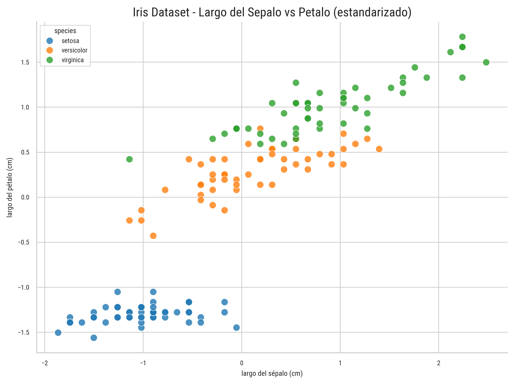

# 🐦 `aves_tablas`: Análisis y Visualización, Educación y Soporte

Este repositorio es un *fork* del repositorio [AVES](https://github.com/zorzalerrante/aves). Contiene todo el código que alude al **manejo de tablas**.

## Instalación

Bastaría con clonar el repositorio e instalar localmente. No es necesario el uso de ambientes virtuales. 

```
git clone https://github.com/DanielHermosilla/aves-tablas

pip install -e .
```

## Ejemplos 

Se utilizará el [dataset de flores iris](https://es.wikipedia.org/wiki/Conjunto_de_datos_flor_iris): el *Hola Mundo* de la Ciencia de Datos.

### Visualización de tablas

```python
from sklearn.datasets import load_iris
from aves_tablas.features.utils import (
    standardize_columns,
)
from aves_tablas.visualization.scatter import scatter_plot

# Configuraciones previas
iris = load_iris()
df = pd.DataFrame(iris.data, columns=iris.feature_names)
df["species"] = pd.Categorical.from_codes(iris.target, iris.target_names)
features = df[iris.feature_names]

# Estandarizar las columnas
standardized = standardize_columns(features)
df_standardized = pd.concat([standardized, df["species"]], axis=1)

fig, ax = plt.subplots(figsize=(8, 6))
scatterplot(
    ax=ax,
    df=df_standardized,
    x="Largo del sépalo (cm)",
    y="Largo del pétalo (cm)",
    hue="species",
    scatter_args={"s": 60, "alpha": 0.8},
    annotate=False,
    drop_na=True,
)

plt.title("Iris Dataset - Largo del sépalo vs pétalo (estandarizado)", fontsize=14)
plt.tight_layout()
plt.show()

```





```python
from aves_tablas.visualization.bars import barchart

promedio_agrupado = (
    df_standardized.groupby("species")[["largo del sépalo (cm)"]].mean().round(2)
)

fig, ax = plt.subplots(figsize=(6, 4))
barchart(
    ax=ax,
    df=promedio_agrupado,
    categories="largo del sépalo (cm)",
    horizontal=True,
    annotate=True,
    bar_width=0.6,
)
plt.title("Promedio estandarizado de largo del sépalo por especie")
plt.tight_layout()
plt.show()
```


